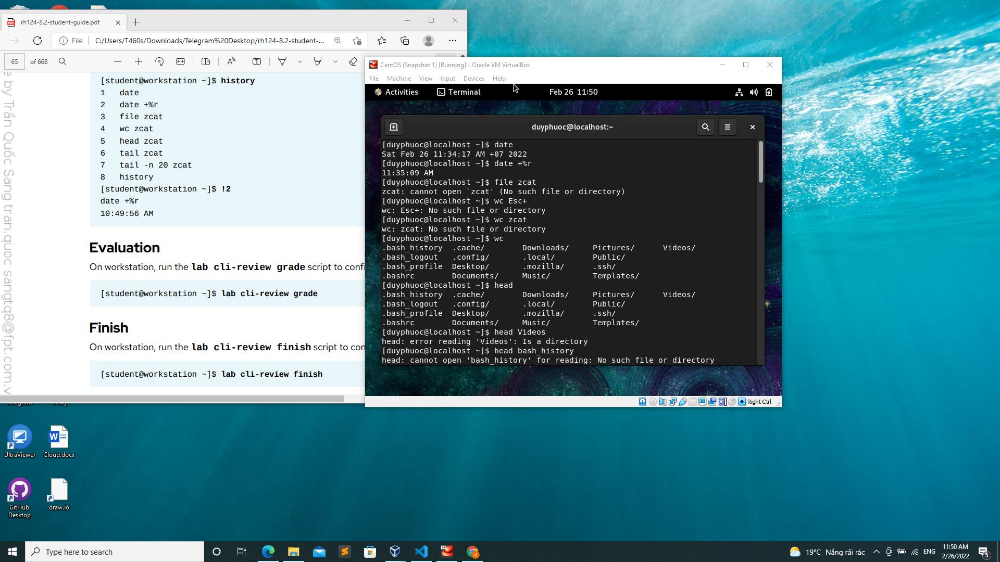

# Truy cập Command Line
- Commad Line là 1 giao diện dựa trên văn bản có thể được sử dụng để nhập các lệnh vào máy tính
# Kiến thức cơ bản về Shell 
- Các lệnh được nhập tại Shell có 3 phần cơ bản:
    - Lệnh chạy
    - Tùy chọn điều chỉnh hành vi của lệnh
    - Các đối số, mục tiêu của lệnh
# Các câu lệnh cơ bản 
- Câu lệnh kiểm tra lần cuối đăng nhập:$ ssh remoteuser@remotehost
- Truy cập vào tệp cá nhân: $ ssh -i mylab.pem remoteuser@remotehost
- Tắt command: Bấm ctrl + D hoặc gõ exit
- Truy cập để chỉnh sửa thời gian: Bấm phím Window + 
- Chuyển tab: Ctrl + Alt + UpArrow  or Ctrl+Alt+DownArrow hoặc bấm vào nút Activities
- Bật command: Alt + F2 rồi nhập lệnh gnome-terminal
- Khóa màn hình: Window + L, mở khóa màn hình bấm Enter hoặc Spacce
- Tắt nguồn hoặc khởi động lại: Ctrl + Alt + Del
- Đổi mật khẩu: $ passwd
- Xem ngày giờ trên commands: $ date
    - Xem giờ: $ date +%R
    - Xem ngày: $ date +%x
- Xem tên user: $whaomi
- Lệnh file là hiển thị và kiểm tra nội dung tệp
- Lệnh cat là hiển thị nội dung trong thư mục
- Lệnh tab là gợi ý lệnh nếu mình quên
- Lệnh head và tail hiển thị 10 dòng đầu và cuối của tệp, - n để hiện thị số dòng muốn hiển thị
- Lệnh wc để đếm dòng và kí tự 1 tệp
- Lệnh history để hiển thị danh sách các lệnh đã thực hiện trước đó
# Bài tập

