# Các thư mục quan trọng:
- /usr(Chương trình của người dùng): Chứa các thư viện, file thực thi, tài liệu hướng dẫn và mã nguồn cho chương trình chạy của hệ thống. 
    - /usr/bin: Chứa các file thực thi của người dùng
    - /usr/sbin: Chứa các file thực thi của hệ thống dưới quyền của admin
    - /usr/local: Chứa các chương trình của người dùng được cài từ mã nguồn
- /etc(Các file cấu hình): Thư mục này chứa các file cấu hình của các chương trình, đồng thời nó còn chứa các shell script dùng để khởi động hoặc tắt các chương trình khác  
- /var(File về biến của chương trình): Thông tin về các biến của hệ thống được lưu trong thư mục này. Như thông tin về log file: /var/log, các gói và cơ sở dữ liệu /var/lib...
- /run(File trạng thái ứng dụng): Thư mục /run chứa file của chương trình đang chạy, nếu khởi động lại sever thì các file trong thư mục /run sẽ bị xóa, chương trình chạy mới trong lần khởi động lại sever ấy thì sẽ tạo mới lưu vào 
- /home(File của người dùng): Thư mục này chứa tất cả các file cá nhân của từng người dùng. Mỗi người dùng chỉ có quyền truy cập ghi vào thư mục trang chủ riêng của họ và phải có quyền nâng cao (trở thành người dùng root) để sửa đổi các tệp khác trên hệ thống.
- /root(File dành cho người dùng Root): đây là thư mục gốc của hệ thống, là nơi bắt đầu của tất cả các file và thư mục. Chỉ có root user mới có quyền ghi trong thư mục này. Chú ý rằng /root là thư mục home của root user chứ không phải là /.
- /tmp(File tạm thời): Các ứng dụng lưu trữ các tệp tạm thời trong thư mục /tmp. Các tệp này thường bị xóa bất cứ khi nào hệ thống của bạn được khởi động lại và có thể bị xóa bất cứ lúc nào
- /boot(File khởi động hệ thống): Tất cả các file yêu cầu khi khởi động như initrd, vmlinux. grub được lưu tại đây.
- /dev(File hệ thống): Các phân vùng ổ cứng, thiết bị ngoại vi như USB, ổ đĩa cắm ngoài, hay bất cứ thiết bị nào gắn kèm vào hệ thống đều được lưu ở đây
# Hệ thống, khái niệm về Linux
- Các câu lệnh:
    - Câu lệnh hiển thị đang truy cập vào thư mục nào ở command: `pwd`
    - Kiểm tra xem có thể truy cập vào thư mục nào: `ls`
    - Truy cập vào thư mục Videos: `cd Videos`
    - Kiểm tra lại xem đang truy cập ở thư mục nào: `pwd`
    - Truy cập sang thư mục khác: `cd /home/user/Documents`
    - Thoát ra khỏi thư mục: `cd`
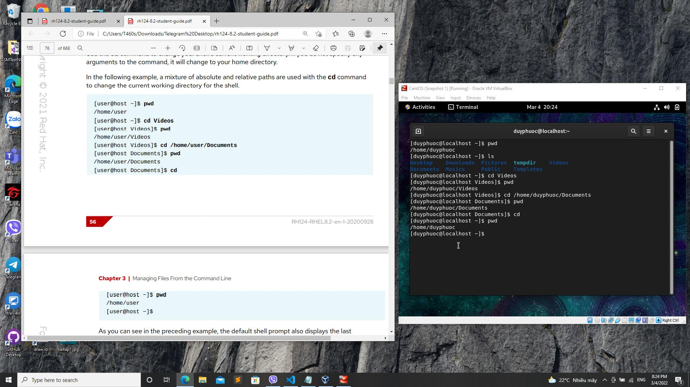
    - Lệnh `touch` mà không có option nào sẽ tạo một file. Nếu file đã tồn tại, lệnh touch sẽ cập nhật thời gian truy cập và chỉnh sửa đến thời gian hiện tại mà không thay đổi nội dung của nó:
    - Lệnh `ls -l`: in tập tin trong một định dạng danh sách dài.
    - Lệnh `ls -la`: Hiển thị các tập tin ẩn
    - Lệnh `ls -R`: Liệt kê các thư mục con
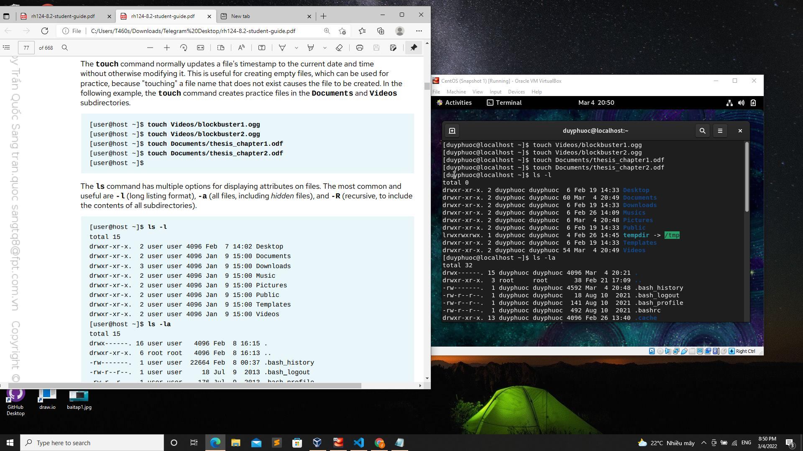
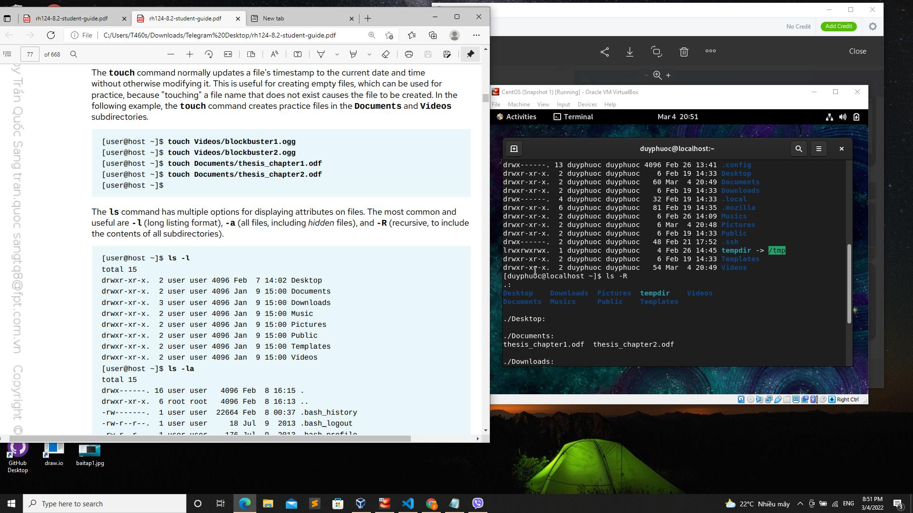
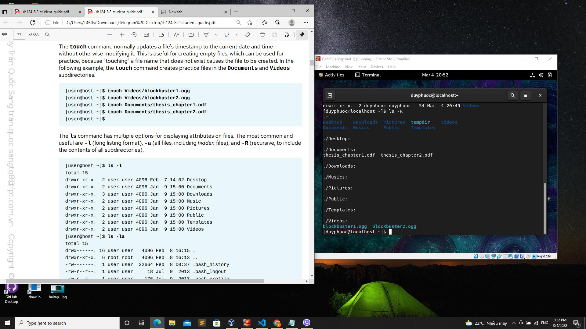
- Lệnh `cd` có nhiều tùy chọn, ví dụ:
    - Lệnh `cd -`: Điều hướng đến thư mục trước đó.
    - Lệnh `cd .`: Không làm gì cả 
    - Lệnh `cd ..`: Giả sử bạn đang trong mục /usr/local/share. Để chuyển đến /usr/local (một mức độ lên từ thư mục hiện tại).
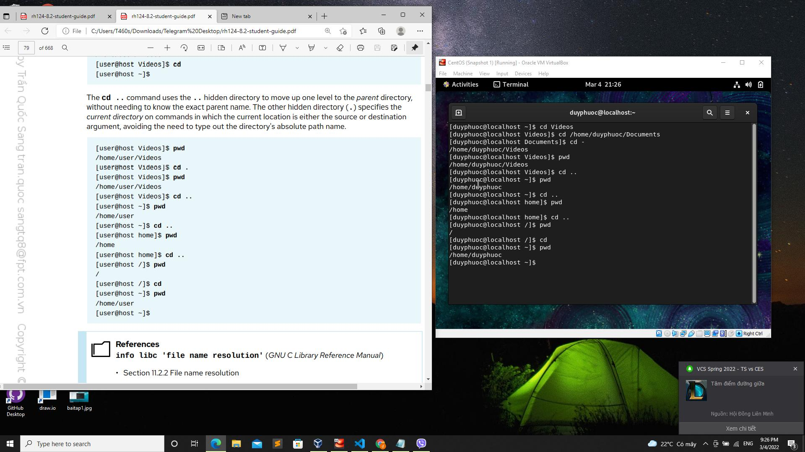
-Tạo thư mục:
    - Tạo thư mục `watched`: mkdir Videos/Watched
    - Tạo thư mục cha cùng với thư mục con: mrdir -p
    - Kiểm tra thư mục Videos: `ls -R Videos`
    - Thoát ra khỏi thư mục Videos vào thư mục Documents: `cd Documents`
    - Tạo 2 tệp con: `mkdir ProjectX ProjectY
    - Tạo thêm tệp con `Thesis`: `mkdir Thesis/Chapter1 Thesis/Chapter2 Thesis/Chapter3`
    - Kiểm tra những thư mục vừa tạo: `ls -R Videos Documents`
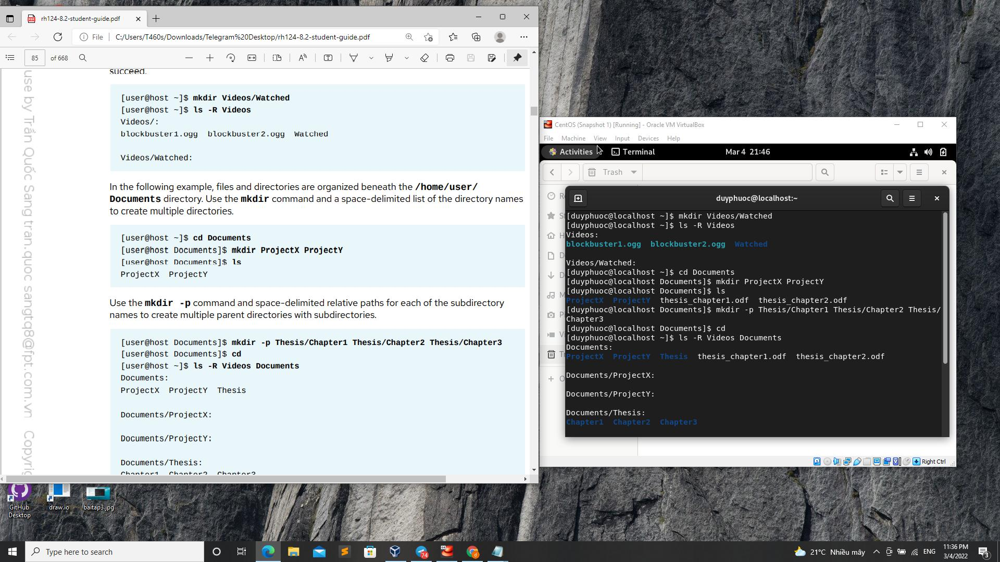
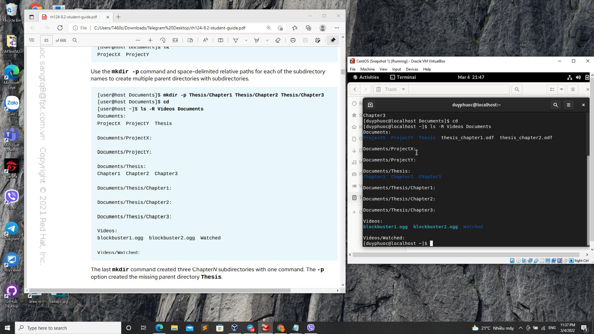
    - Sao chép tệp: `cp file new-file`
    - Sao chép thư mục và nội dung của nó: `cp -r directory new-directory`
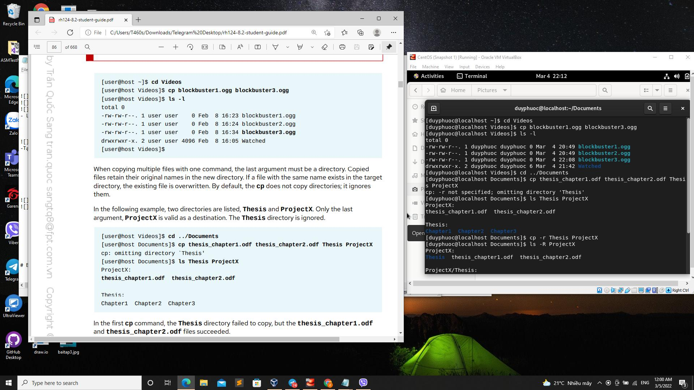
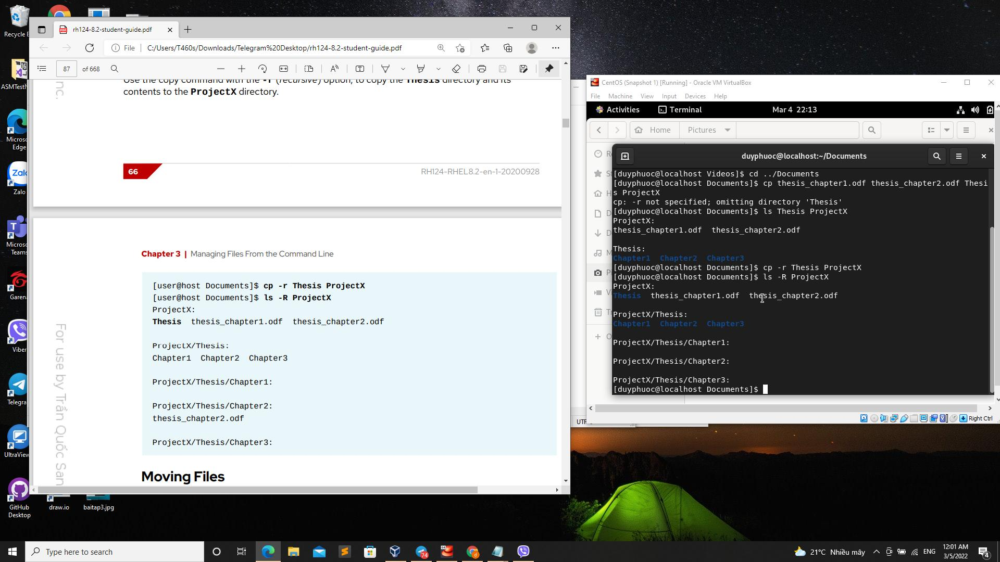
    - Lệnh mv (viết tắt của move) được sử dụng để đổi tên và di chuyển các file và thư mục từ vị trí này sang vị trí khác : `mv file new-file`
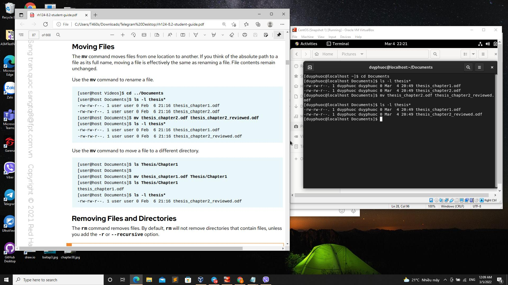

    - Sử dụng lệnh rm để xóa một tệp khỏi thư mục làm việc của bạn: `rm file`
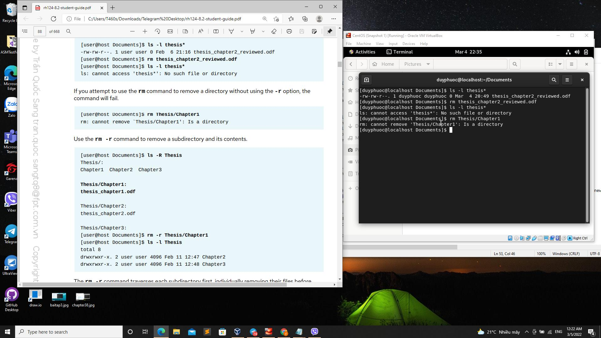
    - Sử dụng lệnh rm -r để xóa thư mục con và nội dung của nó: `rm -r directory`
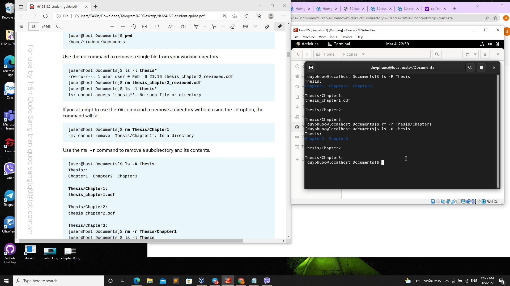
    - Lệnh `rm -ri` để nhắc nhở trước khi muốn xóa
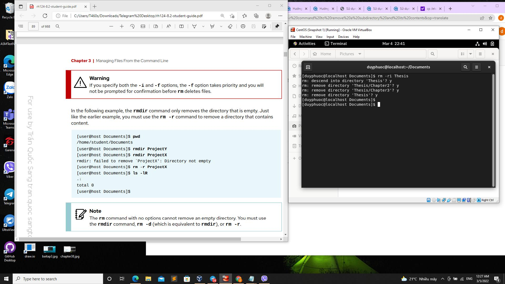
    - Xóa thư mục trống: `rmdir directory`
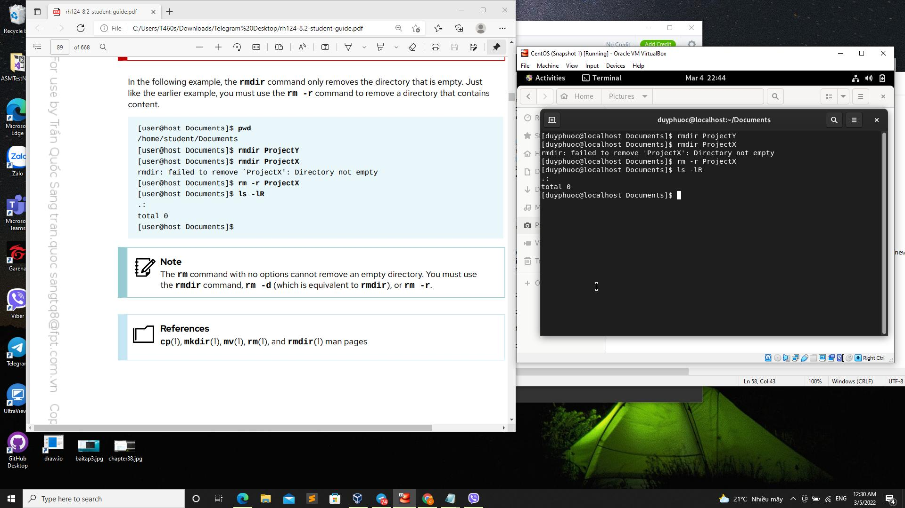    
# Tạo liên kết giữa các Files:
- Tạo Hardlinks:
    - Mọi file đều bắt đầu bằng một liên kết cứng duy nhất, từ tên ban đầu của nó đến dữ liệu trên hệ thống file.
    - Tạo một liên kết cứng mới đến một tệp, tạo một tên khác trỏ đến cùng dữ liệu đó. Các liên kết cứng mới hoạt động chính xác như tên tệp gốc.
    - Sau khi tạo, không thể phân biệt được giữa liên kết cứng mới và tên gốc của tệp
    - Có thể dùng lệnh `ls -l` để kiểm tra sự liên kết 
    - Sử dụng lệnh `ln` để tạo một liên kết cứng mới (tên khác) trỏ đến một tập tin. Lệnh cần ít nhất hai đối số, một đường dẫn đến tệp hiện có và đường dẫn đến liên kết cứng mà bạn muốn tạo.
    - Sử dụng lệnh `ls -il` để xem 2 files có phải là liên kết cứng của nhau, nếu số inode giống nhau thì các file là liên kết cứng có dữ liệu giống nhau.
    - Nếu như file gốc bị xóa thì nội dung của file vẫn còn nếu như vẫn còn liên kết. Dữ liệu chỉ bị xóa khi xóa đi liên kết
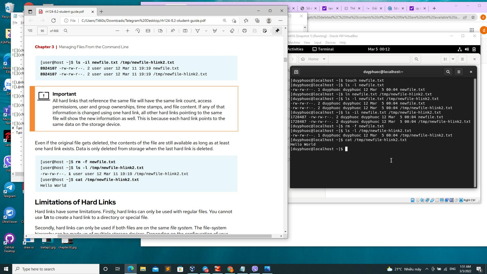  
- Những hạn chế của Hardlinks:
    - Hardlinks chỉ có thể được sử dụng với các tệp thông thường.
    - Không thể sử dụng `ln` để tạo liên kết cứng đến một thư mục hoặc file đặc biệt.
    - Hardlink chỉ có thể sử dụng nếu cả 2 file nằm trên cùng 1 file system
    - Sử dụng lệnh `df` để liệt kê các thư mục nằm trên các file system khác nhau.
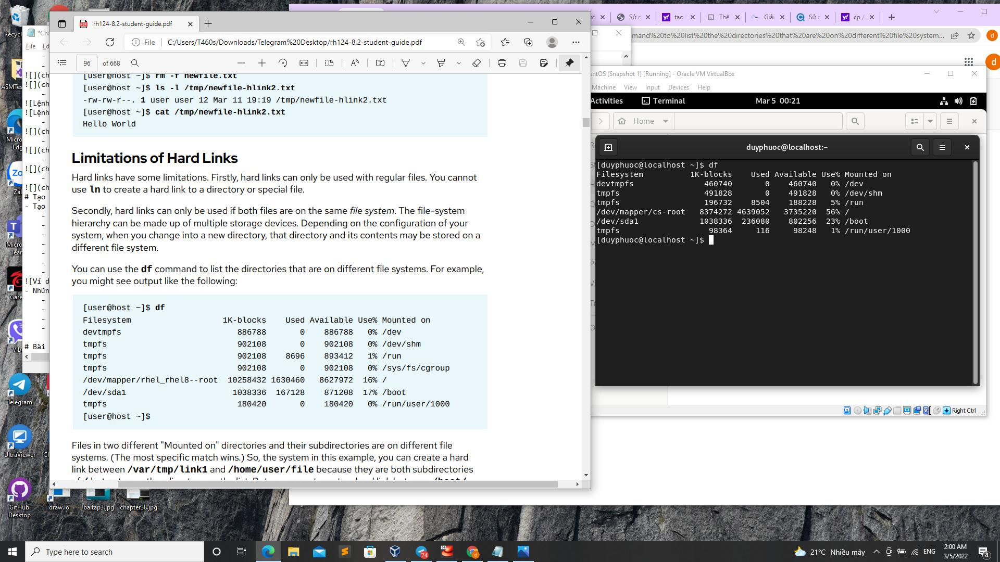 
- Tạo Soft Links:
    - Lệnh `ln -s` tạo ra một liên kết mềm, còn được gọi là "liên kết tượng trưng".
    - Soft Links không phải là một tệp thông thường, nhưng là một loại tệp đặc biệt trỏ đến tệp hoặc thư mục hiện có.
- Soft Links có 1 số ưu điểm hơn Hard Links:
    - Soft Links có thể liên kết hai tệp trên các hệ thống tệp khác nhau
    - Soft Links có thể trỏ đến thư mục hoặc file đặc biệt	
- File đặc biệt là file cung cấp quyền truy cập vào thiếu bị đầu vào và đầu ra 
- Lệnh `ln -s` được dùng để tạo soft links
- Khi file ban đầu bị xóa, soft links vẫn sẽ trỏ đến file nhưng dữ diệu bên trong sẽ bị mất 
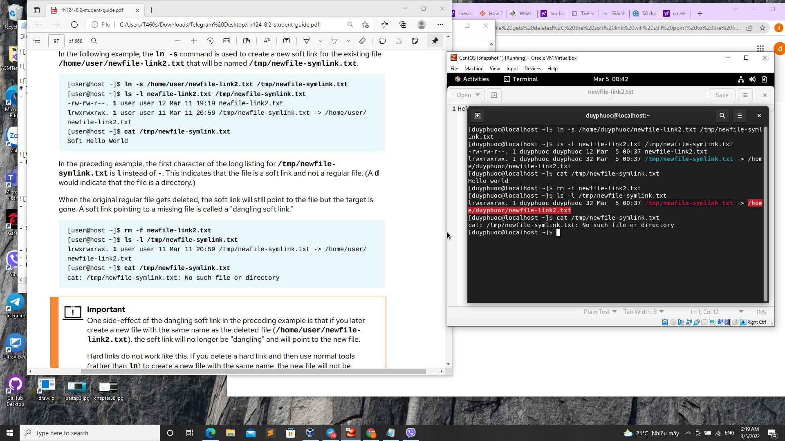
- Tạo 1 soft link tạo 1 thư mục trỏ đến thư mục /etc:
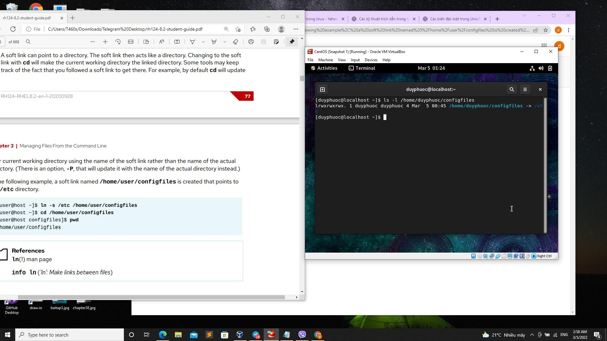
# Matching File Names with Shell Expansions
- Các kí tự cơ bản:
    - [abc...]: Bất kì các kí tự nào có trong dấu ngoặc
    - [!abc...]: Bất kì các kí tự không có trong dấu ngoặc
    - [^abc...]: Bất kì các kí tự không có trong dấu ngoặc
    - [[:alpha:]]: Bất kì các kí tự có trong bảng chữ cái
    - [[:lower:]]: Các kí tự viết thường
    - [[:upper:]]: Các kí tự viết hoa
    - [[:alnum:]]: Các kí tự hoặc chữ số
    - [[:punct:]]: Bất kì kí tự nào không phải là khoảng trắng, chữ và số
    - [[:digit:]]: Bất kì số nào từ 0 -> 9
    - [[:space:]]: Bất kì các khoảng trắng nào, có thể gồm các tab, dòng mới, dấu cách,...
- Pattern Matching
    - Dấu `;` để thực hiện nhiều lệnh trên 1 dòng command
    - a* : chọn ra các files có chữ `a` đầu tiên
    - *a* : sắp xếp theo bảng chữ cái
    - [ac]* : chọn ra các files có chữ `a` và `c` đầu tiên
    - ???? : chọn ra các files có 4 kí tự
    - ????? : chọn ra các files có 5 kí tự
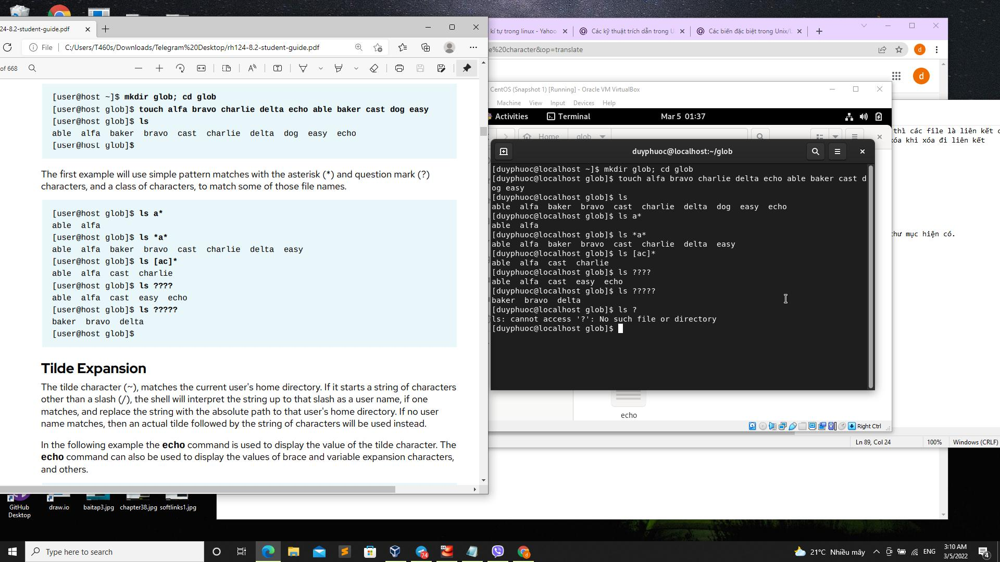 
- Tilde Expansion
    - Lệnh echo được sử dụng để hiện thị thư mục đứng sau dấu /~/
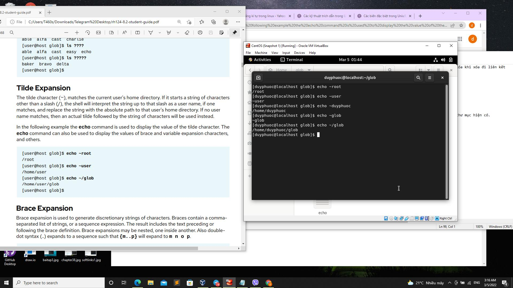 
- Brace Expansion
    - Lệnh echo {a..e}.abc là để hiện thị các chuỗi từ (a -> e).abc
    - Tạo nhanh nhiều thư mục: `mrdir ../ABC{1,2,3}
- Variable Expansion
    - Một biến hoạt động giống như một vùng chứa được đặt tên có thể lưu trữ một giá trị trong bộ nhớ.
    - Có thể gán dữ liệu dưới dạng giá trị cho một biến bằng cú pháp sau: A=b
    - Để tránh bị nhầm do mở rộng các shell khác có thể đặt tên của biến dưới dạng dấu ngoặc nhọn   
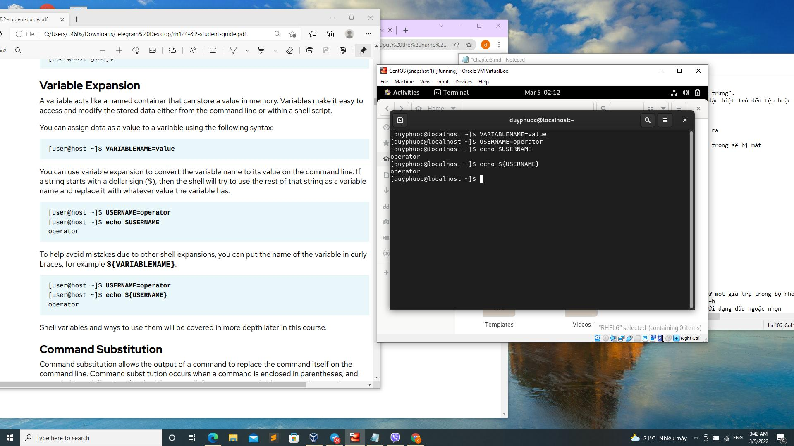
- Command Substitution
    - Lệnh $(command) có thể lồng nhiều lệnh ở bên trong
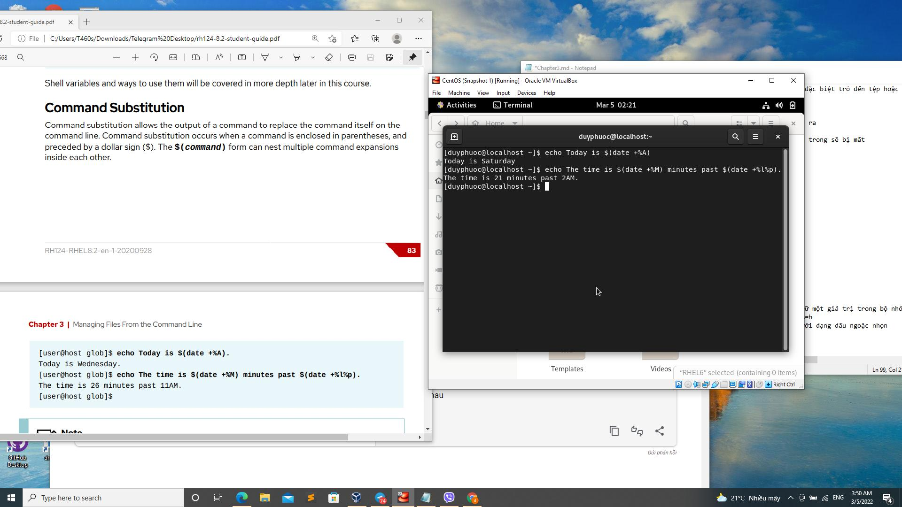
- Protecting Arguments from Expansion
    - Dấu (\) là một ký tự thoát trong Bash shell.
    - Sử dụng dấu (") để ngăn chặn mở rộng nhưng vẫn cho phép lệnh và thay thế biến.
    - Sử dụng dấu (') để giữ nguyên không thay đổi giá trị biến
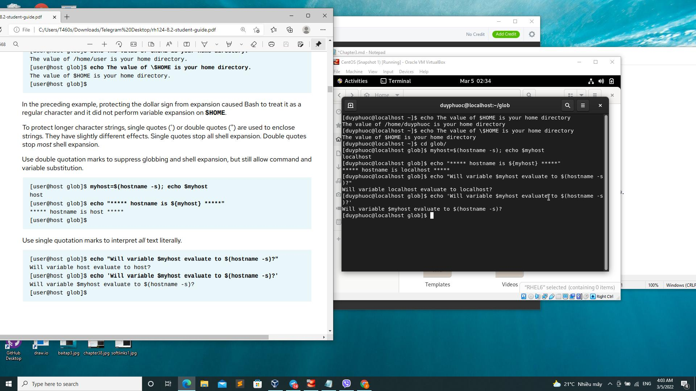

