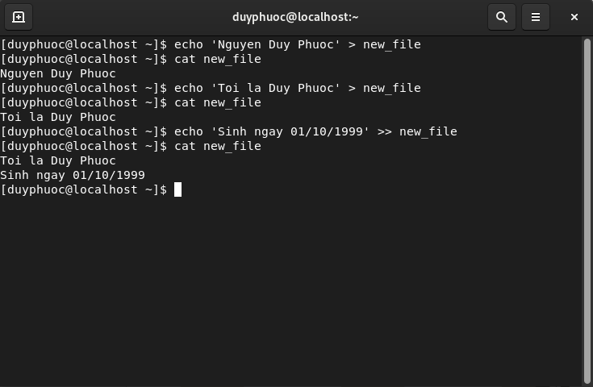
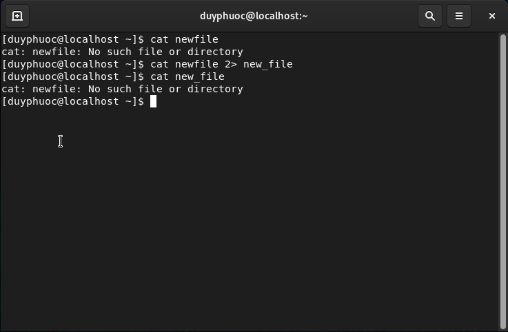
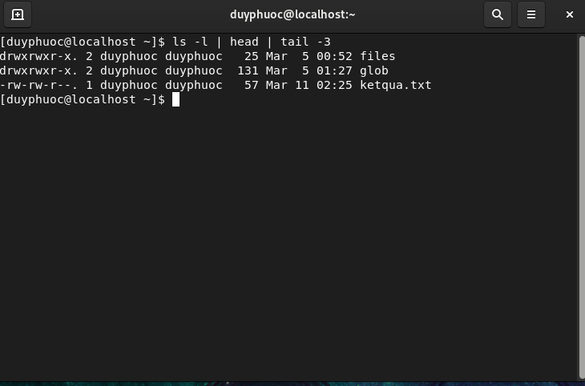
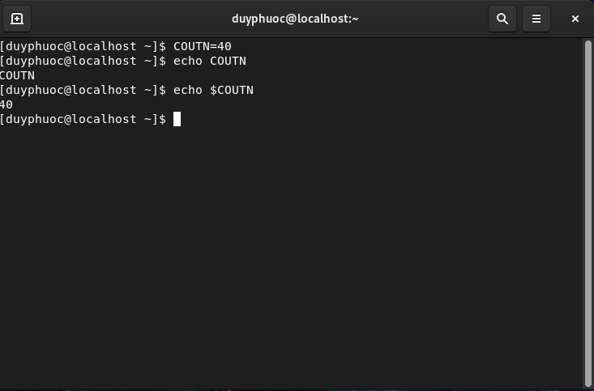
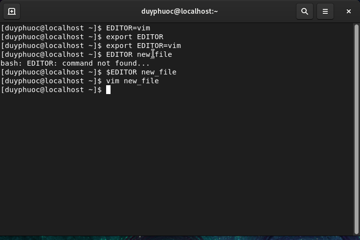
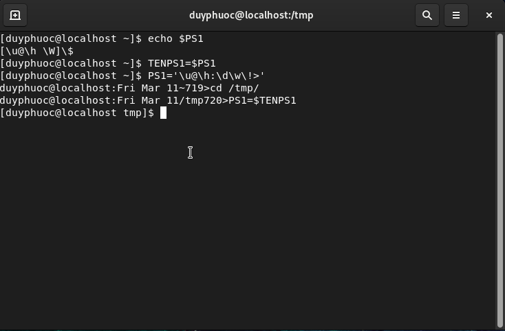

# Standard Input, Standard Output, and Standard Error
- Luồng dữ liệu: Các chương trình trong Linux sẽ tự động được kết nối với 3 luồng dữ liệu khi chúng được thực thi
	- stdin (0): Thường là những thiết bị nhập input cho Shell ví dụ như bàn phím
	- stdout (1): Hiển thị kết quả các lệnh lên terminal.
	- stderr (2): Hiển thị ra các lỗi trong quá trình thực hiện 1 lệnh hoặc 1 công việc nào đó
- Các dạng chuyển hướng:
	- Chuyển hướng tới file:
		- Để chuyển hướng 1 câu lệnh tới file, Linux cung cấp cho người sử dụng 2 cú pháp:
 			- `<`: Ghi nội dung ra file từ điểm bắt đầu, nếu file đã có nội dung thì ghi đè 
 			- `<<`: Tương tự `<` nhưng thay vì ghi đè lên nội dung cũ thì sẽ ghi từ điểm kết thúc của nội dung cũ

	- Chuyển hướng tới stderr:
		- Khi một câu lệnh gặp lỗi, thông tin lỗi sẽ hiển thị luôn lên màn hình cùng với các dữ liệu đầu ra
		- Linux cung cấp ký hiệu `2>` để đưa nội dung thông báo lỗi ra file thay vì màn hình hiển thị.

	- Chuyển hướng tới câu lệnh khác:
		- Đưa đầu ra của một câu lệnh tới câu lệnh khác như đầu vào
		- Sử dụng ký hiệu `|` để chuyển hướng

# Editing Text Files from the Shell Prompt
- `Vim` là 1 câu lệnh có chức năng biên soạn file text trong linux.
- Các chế độ của Vim:
	- Insert Mode: Chế độ Insert cho phép bạn chèn dữ liệu vào file đang mở. Phím tắt là `i`
	- Visual Mode: Chế độ Visual cho phép người dùng chọn văn bản như sử dụng chuột, nhưng sử dụng bàn phím thay vì dùng chuột. Phím tắt là "V", rất hữu ích khi bạn muốn copy nhiều dòng dữ liệu.
	- Command Mode: Đây là chế độ dòng lệnh bắt đầu bằng dấu hai chấm `:`, đây là chế độ mặc định khi bạn mở Vim editor. Khi đang ở chế độ khác mà bạn muốn quay trở về chế độ command mode thì sử dụng phím Esc
- Một số lệnh cần nhớ khi sử dụng `Vim`:
	- Để mở file cần sửa nội dung: `vim tenfile`
	- Để Copy từ đoạn này đến đoạn kia: ấn phím `y` để copy và `p` để paste
	- Để xóa văn bản ấn phím `x`
	- Để thoát mà không lưu `:q!`
	- Để lưu lại file và thoát `:wq!`
	- Để quay lại nội dung trước khi sử dùng phím `u`
	- Để hiện số dòng thì dùng `:set number`
# Biến môi trường là gì?
- Biến môi trường là các đại lượng có các giá trị cụ thể. Một số biến môi trường được cung cấp các giá trị đặt trước của hệ thống và các biến khác được đặt trực tiếp bởi người dùng, tại dòng lệnh hoặc trong khi khởi động các tập lệnh khác.
- Biến môi trường là một chuỗi ký tự chứa thông tin được sử dụng bởi một hoặc nhiều ứng dụng.
- Gắn giá trị cho biến shell bằng cú pháp: `VARIABLENAME=value`
- Sử dụng lệnh `set` để liệt kê tất cả các biến shell đang được thiết lập, lệnh `less` để xem từng trang một.
- Truy xuất giá trị với biến:
	- Để tham chiếu đến giá trị mà biến đã đặt sử dụng `$` đặt trước tên của biến

- Gán 1 giá trị với 1 lệnh ta sử dụng hàm `export` để gán

- Để hủy gán giá trị ta dùng `unset` để hủy.
- Biến môi tường PS1 sử dụng để tùy chỉnh chuỗi nhắc trong cửa số đầu cuối hiển thị thông tin.
- PS1 là biến chính điều khiển dấu nhắc của dòng lệnh. Các kí tự đặc biệt trong PS1:
	- \u: Tên người dùng
	- \h: Tên máy chủ
	- \w: Thư mục làm việc hiện tại
	- \!: Số lịch sử của lệnh này
	- \d: Ngày
