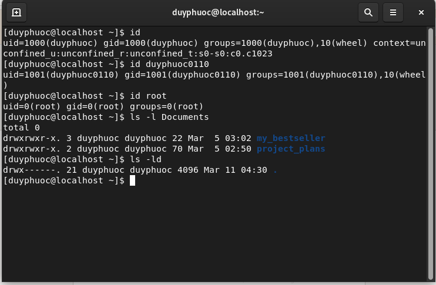
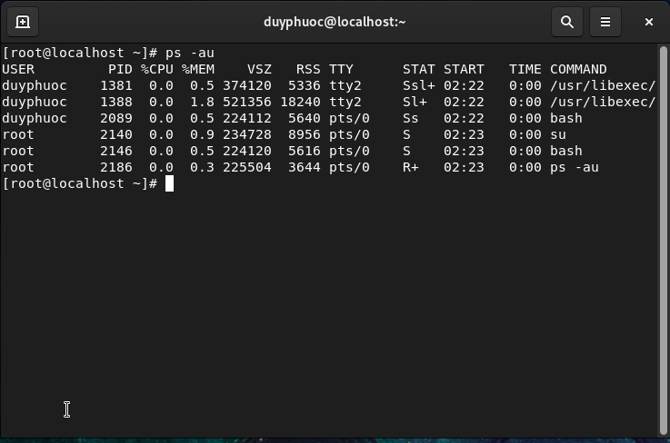
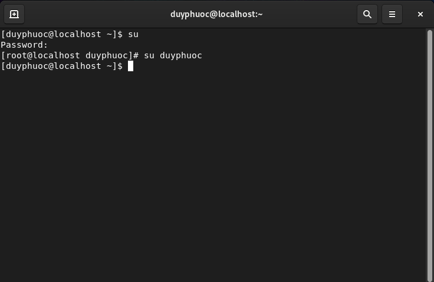

# Describing User and Group Concepts
- User là gì?
	- User chính là người có thể truy cập đến hệ thống. Một User có username và password.
	- Có hai loại User là Super User (hay thường gọi là Root) và Regular User. Mỗi User còn có một mã UID riêng. 
	- Mỗi User khác nhau có quyền trong hệ thống khác nhau phụ thuộc vào hệ thống hoặc Super User đã cấp cho họ những quyền gì.
	- User thông thường bị giới hạn quyền truy cập vào hệ thống.
	- Mỗi tệp đều có một người dùng cụ thể làm chủ sở hữu của nó. Quyền sở hữu tệp giúp ích hệ thống thực thi quyền kiểm soát truy cập cho người dùng tệp.
	- Tài khoản superuser dùng để quản trị hệ thống. Tên của superuser là root và tài khoản có UID 0. Superuser có toàn quyền truy cập vào hệ thống.
	- Sử dụng lệnh `id` để hiển thị thông tin về người dùng hiện đang đăng nhập.
	- Để xem chủ sở hữu của tệp, hãy sử dụng lệnh `ls -l`. Để xem chủ sở hữu của một thư mục, hãy sử dụng `ls-ld`

	- Lệnh `ps` được dùng để xem thông tin của các tiến trình đang hoạt động trong hệ thống.
	- Option a của lệnh ps hiển thị các tiến trình của tất cả người dùng. Chỉ các quy trình không liên kết với terminal và các quy trình của các group leader mới không được hiển thị, u là viết tắt của một định dạng hướng tới người dùng cung cấp thông tin chi tiết về các quy trình.

	- File passwd trong Linux là file cấu hình chứa thông tin chi tiết về người dùng.
	- Một đặc điểm quan trọng của file passwd là nó là file văn bản ASCII mà người dùng có thể chỉnh sửa dễ dàng bằng bất kỳ trình soạn thảo văn bản nào như Nano và Vim.
	- Có thể thêm và quản lý người dùng trực tiếp bằng cách sử dụng file passwd, nhưng không nên thực hiện điều đó vì hành động này dễ mắc lỗi chính tả và gây ra sự cố.
	- Giải thích các trường trong file /etc/passwd:
		- Username: Trường đầu tiên trong một dòng đại diện cho tên người dùng hoặc tên đăng nhập của người dùng.
		- Password: Trường thứ hai hiển thị mật khẩu được mã hóa của người dùng. Vì mục đích bảo mật, mật khẩu được giữ trong một file riêng biệt mà người dùng thông thường không thể đọc được. File /etc/shadow lưu trữ mật khẩu của người dùng trong Linux. Thông thường, trường mật khẩu chứa một dấu x để cho thấy rằng file shadow đang lưu trữ mật khẩu một cách bảo mật. Nếu trường trống thì người dùng không cần mật khẩu để đăng nhập.
		- User ID: Trường User ID, thường được gọi là UID, là một số được hệ thống Linux sử dụng để xác định người dùng. Hầu hết người dùng hệ thống có User ID ít hơn con số 1000 trong khi người dùng thông thường có ID từ 1000 trở lên. Người dùng root (admin) thường có ID là 0. 
		- Group ID: Trường thứ tư dành cho ID nhóm. GID cũng là một số. ID nhóm xác định nhóm chính của một người dùng. GID phân loại tất cả người dùng trong các nhóm cụ thể để việc quản trị dễ dàng hơn. Một người dùng có thể thuộc nhiều nhóm trong Linux.
		- GECOS: thường chứa tên đầy đủ của người dùng và các chi tiết bổ sung như số điện thoại hoặc địa chỉ, được phân tách bằng dấu phẩy. Trường này là tùy chọn và do đó có thể để trống.
		- Home Directory: Trường này chứa thư mục /home được liên kết với người dùng. Đây là thư mục chính lưu trữ các file người dùng chính. Có các thư mục home riêng biệt cho mỗi user 
		- Shell: Trường này chứa tên của shell mặc định được liên kết với người dùng. Shell là môi trường mà người dùng có thể chạy các lệnh và script.
- Group là gì?
	- Group là nhóm người dùng hệ thống. Mỗi nhóm có tên và mã GID riêng. Các User trong Group có thể có những quyền trong hệ thống khác nhau nhưng có một tập hợp quyền chung trong hệ thống đặc trưng cho Group đó.
	- Có hai loại Group trong hệ điều hành Linux:
		- Group chính – Khi User tạo tệp, Group của tệp được đặt thành Group chính của User. Thông thường, tên của Group giống với tên của User. Thông tin về Group chính của User được lưu trữ trong file /etc/passwd.
		- Group thứ cấp hoặc Group bổ sung – Hữu ích khi bạn muốn cấp một số quyền tệp nhất định cho một Group User là thành viên của Group
	- Mỗi User có thể thuộc chính xác một Group chính và không hoặc nhiều Group thứ cấp.
	- Chỉ User root hoặc User có sudo quyền truy cập mới có thể thêm User vào một Group.
	- Hệ thống sử dụng tệp /etc/group để lưu trữ thông tin về các nhóm cục bộ.
	- Mỗi dòng trong tệp /etc/group chứa thông tin về một nhóm. Mỗi mục được chia thành bốn trường được phân tách bằng dấu hai chấm.
		- Thứ nhất là tên nhóm.
		- Mật khẩu nhóm, trường này luôn là dấu x.
		- Số GID của nhóm
		- Danh sách người dùng là thành viên của nhóm
# Gaining Superuser Access
- Tài khoản root là đặc quyền lớn nhất trên hệ thống và có quyền lực tuyệt đối đối với nó (tức là truy cập đầy đủ vào tất cả các file và lệnh).
- Một trong số các quyền hạn của root là khả năng sửa đổi hệ thống theo bất kỳ cách nào bạn muốn, cũng như cấp và thu hồi quyền truy cập cho những user khác, kể cả mặc định dành riêng cho root.
- Dùng lệnh `su` để đăng nhập vào user root. Nếu muốn đăng nhâp vào user khác thì thêm tên user muốn đăng nhập

- Running Commands with `Sudo`:
	-  Do quyền root quá lớn nên thường không được sử dụng. Chỉ trong một số trường hợp đặc biệt, root mới được sử dụng để thực hiện các tác vụ quản lý, các lệnh su và sudo thường được dùng để tạm thời sử dụng quyền root.
	- Lệnh `sudo` cho phép người quản trị hệ thống uỷ quyền cho một thành viên có thể thực hiện chạy một số lệnh nào đó trong hệ thống dưới dạng chủ hoặc người dùng khác.
	- Sudo chỉ chạy dòng lệnh khi được Root cho phép. Tức là, khi chạy Sudo, bạn cần nhập thông tin về tài khoản, mật khẩu mới có thể chạy câu lệnh như người dùng Root. Bên cạnh đó, để xác nhận quyền của các User, Sudo còn dùng file config (/etc/sudoers).
	- Một cách khác để truy cập tài khoản root với sudo là sử dụng lệnh sudo -i.  
	- Các bước cấu hình `sudo`:
		- Bước 1: Đăng nhập vào user `root`
		- Bước 2: Đăng nhập vào file /etc/sudoers để thêm nội dung bằng lệnh `vim /etc/sudoers`
		- Bước 3: Tìm dòng chứa nội dung `%wheel ALL=(ALL) ALL`
		- Bước 4: Thêm 1 dòng vào bên dưới với nội dung tên user muốn cấp quyền sudo `%duyphuoc ALL=(ALL) ALL`
		- Bước 5: Thành công kiểm tra lại xem đã được cấp quyền chưa

# Managing Local User Accounts
- Lệnh useradd trong Linux là lệnh tiêu chuẩn được sử dụng để thêm người dùng mới.
- Nó thiết lập thông tin tài khoản và thư mục chính của người dùng, đồng thời tạo một nhóm riêng tư cho người dùng
- Tại thời điểm này, tài khoản chưa được đặt mật khẩu hợp lệ và người dùng không thể đăng nhập cho đến khi mật khẩu được đặt
- `usermod` là công cụ dòng lệnh cho phép bạn sửa đổi thông tin đăng nhập của người dùng.
- Cú pháp cơ bản của lệnh usermod như sau: `usermod [options] USER`
- Các option của `usermod`:
	- Để thay đổi thông tin bổ sung của người dùng thì hãy chạy lệnh usermod kết hợp với tùy chọn `-c`. Ví dụ: `usermod -c "Ten la gi" USER`
	- Để thêm một user có sẵn trong hệ thống vào một nhóm có sẵn thì chúng ta sử dụng hai tùy chọn `-a -G`. Ví dụ: `usermod -a -G GROUP USER `. Lưu ý rằng hãy luôn sử dụng tùy chọn -a (append) khi thêm người dùng vào một nhóm mới, nếu không thì người dùng sẽ bị xóa khỏi các nhóm không được liệt kê sau tùy chọn -G (tức là sẽ xóa user ra khỏi các nhóm khác).
	- Để thay đổi nhóm chính cho người dùng thì hãy chạy lệnh usermod kết hợp với tùy chọn `-g `đặt phía trước tên user và tên group. Ví dụ: `sudo usermod -g GROUP USER`
	- Lệnh usermod cũng được dùng để thay đổi thư mục home cho người dùng. Thư mục home sẽ có tên trùng với tên tài khoản của người dùng, và nó được đặt trong thư mục /home. Vì một lý do nào đó mà bạn muốn thay đổi thư mục home này thì hãy sử dụng tùy chọn -d với cú pháp sau: `usermod -d HOME_DIR USER`
	- Mỗi user sẽ có một file shell riêng và nó sẽ được kích hoạt mỗi khi user này đăng nhập vào hệ thống. Để thay đổi file shell này thì bạn hãy sử dụng lệnh usermod kết hợp với tùy chọn -s như sau: `usermod -s SHELL USER`
	- Lệnh usermod trong Linux cũng có thể dùng để thay đổi UID. Để thay đổi UID thì ta sử dụng tham số -u. Ví dụ `usermod -u UID USER`
	- Sử dụng lệnh usermod trong Linux để thay đổi tên đăng nhập của user, bằng cách sử dụng tham số -l. Ví dụ `usermod -l NEW_USER USER`
	- Dùng lệnh usermod khóa và mở khóa tài khoản. 
		- Tùy chọn -L cho phép bạn khóa hoặc mở khóa một tài khoản bất kì trên Linux. Ví dụ: `usermod -L USER`
		- Để mở khóa thì chạy lệnh với tùy chọn -U. Ví dụ `usermod -U USER`
- Để xóa user ra khỏi hệ thống Linux thì bạn sử dụng cú pháp như sau: `userdel [OPTIONS] USERNAME`
- Để xóa một user ra khỏi hệ thống linux thì bạn sử dụng cú pháp cơ bản như sau: `userdel username`
- Khi xóa user nó sẽ xóa luôn group mà user đó đang thuộc về nếu group đó không còn user nào.
- Ngoài ra, lệnh đó còn xóa luôn thông tin về user nằm trong file /etc/passwd và /etc/shadow.
- Hầu hết những bản phối của Linux sẽ không xóa thư mục home của người dùng, vì vậy nếu bạn muốn xóa luôn thư mục home của user thì hãy thêm tùy chọn -r . Ví dụ: `userdel -r username`
- Thiết lập mật khẩu cho user mới tạo: `passwd username`
# Managing Local Group Accounts
- Cú pháp lệnh groupadd: `groupadd [OPTIONS] GROUPNAME`
- Lưu ý rằng chỉ có tài khoản root hoặc tài khoản thuộc nhóm root có đặc quyền sudo thì mới chạy được lệnh này.
- Khi lệnh groupadd thực thi thì nó sẽ dựa vào những tùy chọn của lệnh, kết hợp với các giá trị mặc định trong file /etc/login.defs để tạo thông tin cho nhóm.
- Trong Linux, mỗi nhóm sẽ có một GID khác nhau và duy nhất, đó là một số nguyên dương.
- Các option của lệnh groupadd:
	- Tùy chọn -g (--gid) để xác định GID ngay lúc tạo nhóm mới. Ví dụ: groupadd -g 1010 mygroup
	- Thông thường khi bạn cài mới một hệ điều hành Linux thì nó sẽ tạo cho bạn một số nhóm hệ thống có sẵn, nhằm mục đích vận hành hệ thống như: tạo backup hoặc bảo trì hệ thống. Để tạo một nhóm hệ thống thì bạn thêm tham số -r (--system): `groupadd -r mysystemgroup`
- Sửa đổi thông tin nhóm:
	- Lệnh groupmod thay đổi các thuộc tính của một nhóm hiện có. Tùy chọn `-n` chỉ định một tên mới cho nhóm. Ví dụ `sudo groupmod -n group01 group02`
	- Tùy chọn `-g` chỉ định một GID mới. Ví dụ: `sudo groupmod -g 1000 group02`
- Xóa group:
	- Lệnh `groupdel` để xóa các nhóm. Ví dụ: `sudo groupdel group02
# Managing User Passwords
- Bố cục hoàn chỉnh của File /etc/shadow: [username]:[password]:[date of last password change]:[minimum password age]:[maximum password age]:[warning period]:[inactivity period]:[expiration date]:[unused]
	- Thứ nhất là tên người dùng
	- Thứ hai là mật khẩu được mã hóa, trường mật khẩu bao gồm ba trường bổ sung, được phân định bằng ký hiệu đô la: `$id$salt$hash.`
		- id: Điều này xác định thuật toán mã hóa được sử dụng để mã hóa mật khẩu của bạn. Giá trị có thể là 1 (MD5), 2a (Blowfish), 2y (Eksblowfish), 5 (SHA-256) hoặc 6 (SHA-512).
		- salt: Đây là salt được sử dụng để mã hóa và xác thực mật khẩu.
		- hash: Đây là mật khẩu của người dùng khi nó xuất hiện sau khi hash. Tệp shadow lưu giữ phiên bản đã hash của mật khẩu để hệ thống có thể kiểm tra bất kỳ nỗ lực nào để nhập mật khẩu của bạn.
	- Thứ ba là ngày thay đổi mật khẩu cuối cùng
	- Thứ 4 là tuổi của mật khẩu
	- Thứ 5 là Tuổi mật khẩu tối đa
	- Thứ 6 là thời gian cảnh báo
	- Thứ 7 là thời gian không hoạt động
	- Thứ 8 là ngày hết hạn 
	- Thứ 9 là trường không phục vụ mục đích nào và được để dành để sử dụng trong tương lai
- Configuring Password Aging
	- Sử dụng lệnh `chage` để triển khai chính sách bảo mật mật khẩu. Ví dụ: `sudo chage -m 0 -M 90 -W 7 -I 14 username`. Lệnh `chage` sử dụng các tùy chọn -m, -M, -W, và -I để đặt độ tuổi tối thiểu, độ tuổi tối đa, thời gian cảnh báo và thời gian không hoạt động của mật khẩu của người dùng tương ứng
	- Lệnh `chage -d 0 username` buộc người dùng username cập nhật mật khẩu của mình vào lần tiếp theo đăng nhập.
	- Lệnh `chage -l username` hiển thị chi tiết mật khẩu của username.
	- Lệnh `chage -E 2022-03-12 username` khiến tài khoản của người dùng username hết hạn vào 2022-03-12 (ở định dạng YYYY-MM-DD).
	