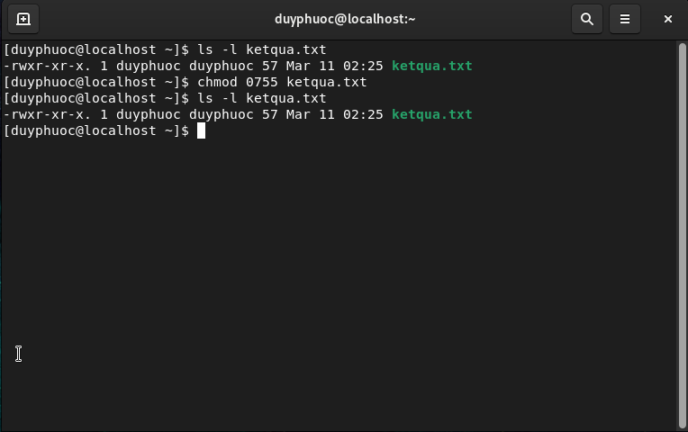

# Interpreting Linux File System Permissions
- Quyền đối với hệ thống tệp của Linux
	- Tệp được sở hữu bởi một người dùng, thông thường người đã tạo tệp. Tệp cũng thuộc sở hữu của một nhóm, thường là nhóm chính của người dùng đã tạo tệp, nhưng điều này có thể được thay đổi.
	- Các quyền khác nhau có thể được đặt cho người dùng sở hữu, nhóm sở hữu và cho tất cả những người dùng khác trên hệ thống không phải là người dùng hoặc thành viên của nhóm sở hữu.
	- Tất cả tệp đều được liên kết với người dùng. Mỗi tệp cũng được liên kết với một nhóm có mối liên quan đến tệp và các quyền nhất định hoặc quyền: đọc, viết và thực thi:
		- r (read): quyền đọc file/folder
		- w (write): quyền ghi/sửa nội dung file/folder
		- x (execute): quyền thực thi (truy cập) thư mục. Đối với thư mục thì bạn cần phải có quyền execute thì mới dùng lệnh cd để truy cập vào được

	- Người dùng thường có cả quyền đọc và thực thi trên các thư mục để họ có thể liệt kê thư mục và có toàn quyền truy cập vào nội dung của nó.
	- Nếu người dùng chỉ có quyền đọc trên thư mục, tên của các tệp trong đó có thể được liệt kê, nhưng không có thông tin nào khác bao gồm cả quyền, cũng như không thể truy cập được.
	- Nếu người dùng chỉ có quyền truy cập thực thi trên thư mục, họ không thể liệt kê tên tệp trong thư mục. Nếu họ biết tên của một tệp mà họ có quyền đọc, họ có thể truy cập nội dung của tệp đó từ bên ngoài thư mục bằng cách xác định rõ ràng tên tệp
	- Một tệp có thể bị xóa bởi bất kỳ ai có quyền sở hữu hoặc quyền ghi vào thư mục, bất kể quyền sở hữu hoặc quyền đối với chính tệp đó.
- Xem quyền và quyền sở hữu đối với tệp và thư mục
	- Tùy chọn `-l` của lệnh `ls` hiển thị thông tin chi tiết về quyền và quyền sở hữu
	- Sử dụng tùy chọn `-d` để hiển thị thông tin chi tiết về bản thân thư mục chứ không phải nội dung của nó.
	- Dấu `-` là 1 tệp thông thường, `l` là soft link, `d` là thư mục
	- Tùy chọn -a hiển thị quyền của các tệp ẩn, bao gồm các tệp đặc biệt được sử dụng để đại diện thư mục và cha của nó.

- Ví dụ như nhất là lệnh xem file:
	- `rw-rw-r--`: có thể thấy nó có 1 số dấu gạch ngang(-). điều đó có nghĩa là chưa bật đủ quyền dành cho nó, mỗi quyền sẽ được mô tả bằng một dấu `-`.
		- rw-: Đối tượng thứ nhất chính là quyền dành cho user sở hữu nó.
		- rw-: Đối tượng thứ hai chính là quyền dành cho `CÁC` user thuộc group đang sở hữu nó.
		- r--: Đối tượng thứ ba chính là quyền dành cho `MỌI` user không thuộc quyền sở hữu và không thuộc group sở hữu.
	- Vậy cái đoạn rw-rw-r-- nghĩa là “User duyphuoc được phép đọc và sửa file, các user thuộc group duyphuoc có thể đọc và sửa file, còn những người còn lại là chỉ được đọc file“.
	- Đoạn thứ 2 tương tự đoạn thứ 1
- Quyền quản lý đối với hệ thống tệp từ dòng lệnh
# Managing File System Permissions from the Command Line
- Thay đổi quyền đối với tệp và thư mục:	
	- Để phân lại quyền cho cả file/folder trên Linux thì bạn sẽ sử dụng lệnh tên là `chmod`.
	- Cấu trúc của lệnh này là `chmod WhoWhatWhich file|directory` trong đó:
		- Who là `u,g,o,a` là user, group, other, all
		- What là `+,-,=` là thêm, xóa và thay thế toàn bộ tập hợp cho 1 nhóm quyền
		- Which là `r,w,x` là đọc, ghi, thực thi 

- Thay đổi quyền bằng phương pháp số
	- Ở chế độ này, chmod sử dụng các số thuộc hệ bát phân. Loại cú pháp trên có thể khó gõ và nhớ. Vì vậy chúng ta thường sử dụng định dạng số của chmod cung cấp một cách biểu diễn và gán chế độ truy cập bằng 4 số bát phân. 3 số bên phải là quyền truy cập của chủ sở hữu, nhóm và người dùng khác số thứ 4 từ phải sang trái biểu diễn các cờ đặc biệt setuid, setgid và sticky
	- Bảng các số chỉ định 3 quyền:
		- Số 0 là thể hiện không cho phép quyền, kí hiệu `---`
		- Số 1 là thể hiện quyền thực thi, kí hiệu `--x`
		- Số 2 là thể hiện quyền viết, kí hiệu `-w-`
		- Số 3 là thể hiện quyền viết và thực thi, kí hiệu `-wx`
		- Số 4 là thể hiện quyền đọc, kí hiệu `r--`
		- Số 5 là thể hiện quyền đọc và thực thi, kí hiệu `r-x`
		- Số 6 là thể hiện quyền đọc và viết, kí hiệu `rw-`
		- Số 7 là thể hiện quyền đọc viết và thực thi, kí hiệu `rwx`

# Thay đổi quyền sở hữu tệp, thư mục:
- Quyền sở hữu tệp có thể được thay đổi bằng lệnh chown (thay đổi chủ sở hữu). Ví dụ `chown tênuser tênfile`
- Sử dụng option -R để thay đổi toàn bộ file trong thư mục. Ví dụ `chown -R tênuser tênthưmục`
- Thay đổi group của thư mục. Ví dụ `chown :tengroup tênfile` 
- Để thay đổi cả chủ sở hữu và nhóm của tệp, hãy sử dụng lệnh chown theo sau bởi chủ sở hữu mới và nhóm được phân tách bằng dấu hai chấm (:) không có khoảng trắng can thiệp và tệp đích. Ví dụ: `chown USER:GROUP file`
# Quản lý quyền mặc định và quyền truy cập tệp
- Quyền đặc biệt là: Quyền hạn đặc biệt tạo ra level truy cập thứ 4 bên cạnh user, group và other. Quyền hạn đặc biệt cho phép thêm một đặc quyền vượt lên những quyền hạn thông thường. Mỗi level có một quyền hạn đặc biệt riêng cho nó.
- u+s(SUID) một quyền đặc biệt cho user access level có một chắc năng duy nhất. Một file với SUID luôn được thực thi với user sở hữu files đó, không quan tâm tới user nào đang thực thi câu lệnh. Nếu chủ sở hữu file không có quyền execute, bạn có thể dùng một chữ S in hoa ở đây
- g+s(SGID) quyền hạn đặc biệt này có một số chức năng như sau:
	- Nếu được đặt trên một files, nó cho phép files này được thực thi như group sở hữu files đó (Tương tự SUID)
	- Nếu được đặt trên một thư mục, bất cứ files nào tạo trong thư mục đó sẽ được cấp quyền cho group sở hữu
	- Nếu nhóm không có quyền thực thi, cái này được thay thế bằng chữ S viết hoa
- o+t(sticky): Quyền hạn này không ảnh hưởng tới các files riêng lẻ. Nhưng ở cấp độ thư mục, nó ngăn chặn việc xoá files. Chỉ có người sở hữu (và root) của file này có thể xoá file/và thư mục. Nếu `other` không có quyền thực thi, thì đây được thay thế bằng chữ T viết hoa.

- Đặt quyền đặc biệt:
	- Symbolically: setuid = u+s; setgid = g+s; sticky = o+t
	- Numerically (fourth preceding digit): setuid = 4; setgid = 2; sticky = 1. Cú pháp là `chmod X### file | directory`

- Quyền đối với tệp mặc định:
	- Khi bạn tạo một tệp hoặc thư mục mới, nó sẽ được chỉ định các quyền ban đầu.	
	- Có hai điều ảnh hưởng đến các quyền ban đầu này. Đầu tiên là bạn đang tạo một tệp thông thường hay một thư mục. Thứ hai là umask hiện tại.
	- Nếu bạn tạo một thư mục mới, hệ điều hành sẽ bắt đầu bằng cách gán cho nó các quyền bát phân 0777(drwxrwxrwx).
	- Nếu bạn tạo một tệp thông thường mới, hệ điều hành sẽ gán cho nó quyền bát phân 0666 (-rw-rw-rw-)
	- Luôn phải thêm rõ ràng quyền thực thi vào một tệp thông thường.
	- Sử dụng lệnh umask với một đối số số để thay đổi umask hiện tại shell.
	- Đối số phải là một giá trị bát phân tương ứng với giá trị umask mới.
	- Có thể bỏ qua bất kỳ số 0 nào ở đầu trong umask.
	- Các giá trị umask mặc định của hệ thống cho người dùng Bash shell được xác định trong /etc/profile và /etc/bashrc.
	- Người dùng có thể ghi đè các giá trị mặc định của hệ thống trong .bash_profile và .bashrc các tệp trong thư mục chính của họ.